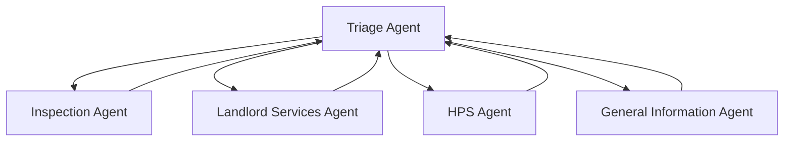

# Housing Authority Assistant

A comprehensive multi-agent customer service system built with the OpenAI Agents SDK, designed specifically for housing authority services including HQS inspections, Section 8 assistance, and Housing Program Specialist (HPS) support.


*Agent View showing the complete 5-agent orchestration system*


*Customer View with clean chat interface*

## 🎥 Demo Video

[](docs/videos/housing-authority-demo.mp4)

## ✨ Features

### 🏠 **5-Agent Housing Authority Framework**
- **Triage Agent**: Intelligent request routing to appropriate specialists
- **Inspection Agent**: HQS scheduling, rescheduling, cancellation, and requirements
- **Landlord Services Agent**: Section 8 documentation and payment assistance
- **HPS Agent**: Housing Program Specialist appointments and income reporting
- **General Information Agent**: Hours, contacts, and FAQ responses

### 🌐 **Multilingual Support**
- **Auto-detection** for English, Spanish, and Mandarin
- **Context persistence** maintains language preference throughout conversation
- **Culturally appropriate** responses for housing services

### 🛡️ **Advanced Guardrails**
- **Relevance filtering** ensures housing authority topics only
- **Data privacy protection** for sensitive tenant information
- **Authority limitation** enforcement
- **Jailbreak prevention** with helpful contact alternatives
- **Custom refusal messages** with SMC Housing contact information

### 📋 **Housing Authority Context Management**
- **T-code system** for case worker reference
- **Participant tracking** (name, phone, email, unit address)
- **Inspection scheduling** with date/time coordination
- **HPS appointments** and documentation status
- **Language preference** persistence

## 🚀 Quick Start

### Prerequisites

- **Node.js** 18+ and npm
- **Python** 3.10+
- **OpenAI API Key** with Agents SDK access

### 1. Clone Repository

```bash
git clone https://github.com/yourusername/housing-authority-assistant.git
cd housing-authority-assistant
```

### 2. Backend Setup

```bash
cd python-backend

# Create virtual environment
python -m venv .venv
source .venv/bin/activate  # On Windows: .venv\Scripts\activate

# Install dependencies
pip install -r requirements.txt

# Set up environment variables
cp .env.example .env
# Edit .env and add your OpenAI API key:
# OPENAI_API_KEY=your_openai_api_key_here
```

### 3. Frontend Setup

```bash
cd ui

# Install dependencies
npm install

# Build the application
npm run build
```

### 4. Start the Application

**Terminal 1 - Backend:**
```bash
cd python-backend
source .venv/bin/activate
python -m uvicorn api:app --reload --host 0.0.0.0 --port 8000
```

**Terminal 2 - Frontend:**
```bash
cd ui
npm start
```

### 5. Access the Application

- **Frontend**: http://localhost:3000
- **Backend API**: http://localhost:8000
- **Health Check**: http://localhost:8000/health

## 📖 Detailed Setup Guide

For comprehensive setup instructions, see: [docs/setup/DETAILED_SETUP.md](docs/setup/DETAILED_SETUP.md)

## 🎯 Usage Examples

### Scheduling an Inspection
```
User: "I need to schedule an HQS inspection for my apartment at 123 Main St"
→ Routes to Inspection Agent
→ Collects address, preferred date/time
→ Creates inspection ID and confirmation
```

### Multilingual Support
```
User: "Necesito programar una inspección"
→ Auto-detects Spanish
→ Responds in Spanish: "Claro, para programar una inspección..."
→ Maintains Spanish throughout conversation
```

### Landlord Services
```
User: "I need Section 8 landlord forms"
→ Routes to Landlord Services Agent
→ Provides appropriate documentation
→ Offers payment method updates
```

## 🏗️ Architecture

### Backend Structure
```
python-backend/
├── main.py              # Core agents and business logic
├── api.py               # FastAPI endpoints and routing
├── requirements.txt     # Python dependencies
└── .env                 # Environment variables
```

### Frontend Structure
```
ui/
├── app/                 # Next.js app directory
├── components/          # React components
├── lib/                 # Utilities and API calls
├── public/              # Static assets
└── package.json         # Node.js dependencies
```

### Agent Architecture


## 🔧 Configuration

### Environment Variables

**Required:**
- `OPENAI_API_KEY`: Your OpenAI API key with Agents SDK access

**Optional:**
- `LOG_LEVEL`: Set to `DEBUG` for verbose logging (default: `INFO`)

### Customization

#### Adding New Agents
1. Create agent in `python-backend/main.py`
2. Add to imports in `python-backend/api.py`
3. Update `_get_agent_by_name()` mapping
4. Add to `_build_agents_list()` return

#### Modifying Guardrails
Update guardrail definitions in `python-backend/main.py`:
```python
relevance_guardrail = guardrail_function(
    name="Custom Relevance Guardrail",
    instructions="Your custom instructions here..."
)
```

#### Frontend Customization
- **Branding**: Update `ui/components/agent-panel.tsx`
- **Colors**: Modify Tailwind classes throughout components
- **Context Fields**: Update interfaces in `ui/components/conversation-context.tsx`

## 🧪 Testing

### Backend Testing
```bash
cd python-backend
# Test API health
curl http://localhost:8000/health

# Test chat endpoint
curl -X POST http://localhost:8000/chat \
  -H "Content-Type: application/json" \
  -d '{"message": "I need to schedule an inspection"}'
```

### Frontend Testing
```bash
cd ui
npm run lint        # Lint checking
npm run type-check  # TypeScript validation
npm run test        # Run test suite (if configured)
```

### End-to-End Testing
1. Start both backend and frontend
2. Visit http://localhost:3000
3. Test conversation flows:
   - Inspection scheduling
   - Multilingual responses
   - Guardrail blocking
   - Agent handoffs

## 📸 Screenshots

### Agent View

- Complete agent orchestration
- Real-time event tracking
- Guardrail monitoring
- Context management

### Customer View

- Clean chat interface
- Multi-agent responses
- Seamless handoffs

### Inspection Scheduling

- Step-by-step scheduling
- Date/time coordination
- Confirmation details

### Multilingual Support

- Auto-language detection
- Native language responses
- Context persistence

## 🎬 Video Documentation

### Demo Videos
- [Complete System Demo](docs/videos/housing-authority-demo.mp4) - 5-minute overview
- [Agent Handoffs](docs/videos/agent-handoffs.mp4) - Routing demonstration
- [Multilingual Features](docs/videos/multilingual-demo.mp4) - Language support
- [Setup Walkthrough](docs/videos/setup-guide.mp4) - Installation guide

### Adding Your Own Videos

GitHub supports video files up to 10MB. For larger files:

1. **Upload to docs/videos/:**
   ```bash
   # Add video files (MP4, MOV, WEBM supported)
   cp your-demo.mp4 docs/videos/
   git add docs/videos/your-demo.mp4
   ```

2. **Reference in documentation:**
   ```markdown
   [](docs/videos/your-demo.mp4)
   ```

3. **For larger videos, consider:**
   - YouTube/Vimeo with embedded links
   - GitHub Releases for large assets
   - Git LFS for version-controlled large files

## 🤝 Contributing

1. Fork the repository
2. Create a feature branch: `git checkout -b feature/your-feature`
3. Make your changes and test thoroughly
4. Update documentation and screenshots if needed
5. Commit with descriptive messages
6. Push and create a Pull Request

### Development Workflow
```bash
# Start development servers
npm run dev          # Frontend with hot reload
python -m uvicorn api:app --reload  # Backend with auto-reload
```

## 📚 Additional Resources

- [OpenAI Agents SDK Documentation](https://platform.openai.com/docs/agents)
- [Next.js Documentation](https://nextjs.org/docs)
- [FastAPI Documentation](https://fastapi.tiangolo.com/)
- [Detailed Setup Guide](docs/setup/DETAILED_SETUP.md)
- [API Reference](docs/setup/API_REFERENCE.md)
- [Troubleshooting Guide](docs/setup/TROUBLESHOOTING.md)

## 🐛 Troubleshooting

### Common Issues

**Backend won't start:**
- Verify OpenAI API key is set correctly
- Check Python version (3.10+ required)
- Ensure all dependencies installed: `pip install -r requirements.txt`

**Frontend build errors:**
- Clear Next.js cache: `rm -rf .next`
- Reinstall dependencies: `rm -rf node_modules && npm install`
- Check Node.js version (18+ required)

**API connection issues:**
- Verify backend is running on port 8000
- Check CORS configuration in `python-backend/api.py`
- Confirm proxy settings in `ui/next.config.mjs`

For more troubleshooting, see: [docs/setup/TROUBLESHOOTING.md](docs/setup/TROUBLESHOOTING.md)

## 📄 License

This project is licensed under the MIT License - see the [LICENSE](LICENSE) file for details.

## 🏠 About

Built for SMC Housing Authority to provide comprehensive customer service automation with multi-agent orchestration, multilingual support, and specialized housing authority workflows.

---

**Contact**: customerservice@smchousing.org  
**Technical Support**: For technical issues, please open a GitHub issue.